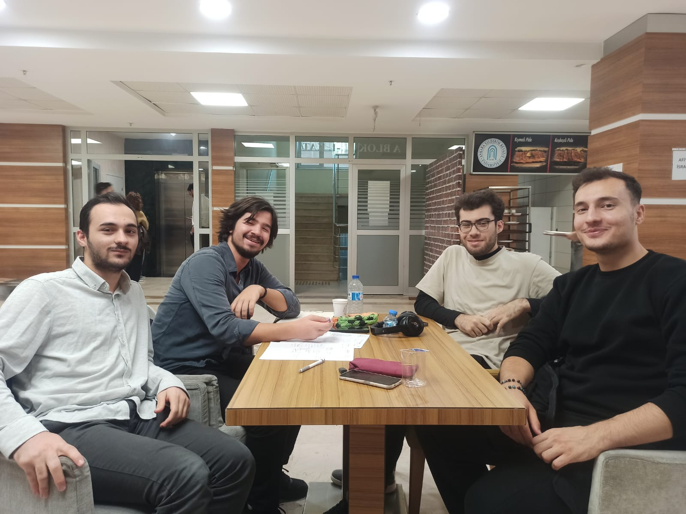
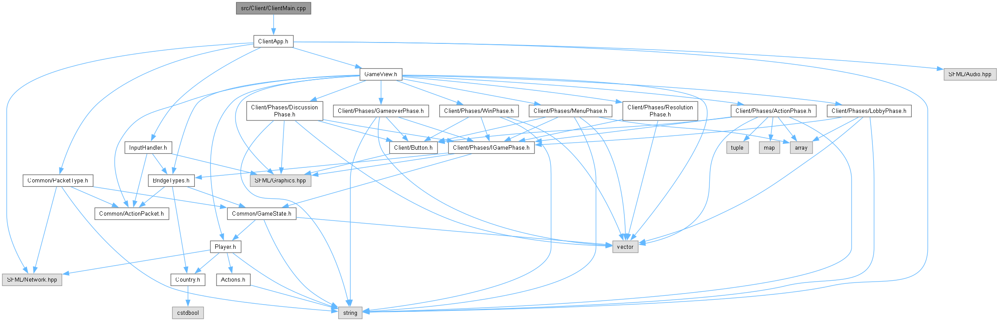
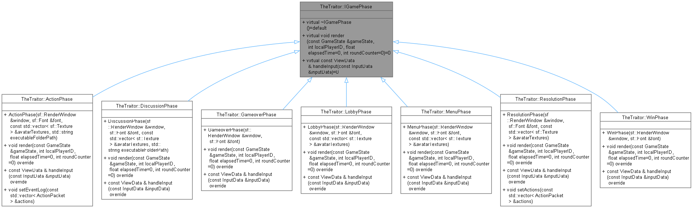
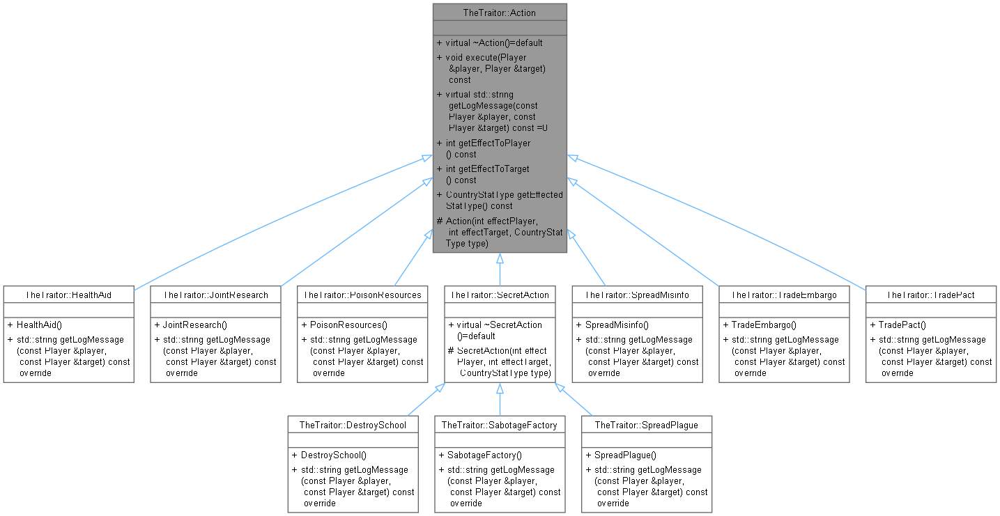

# OOP Project Group 19
This repository contains code and documents for our 2025-2026 Fall semester project for CENG201 (Object Oriented Programming) course. \
Note: To triangulate map parts, we used earcut.hpp from https://github.com/mapbox/earcut.hpp. \
Icons by https://icons8.com/.

## Group Members
Muhammed Enes Karaca, 23050111049 \
Enes Can Bozkurt, 23050111060 \
Muhammed Yıldız, 23050151035 \
Ahmet Yasin Çetinkaya, 23050111051

Photo from first meeting:

## How to Build

### On Linux
Because this project uses static linking, this command needs to run to install dependencies of SFML: \
`sudo apt-get update && sudo apt-get install libxrandr-dev libxcursor-dev libxi-dev libudev-dev libflac-dev libvorbis-dev libogg-dev libopus-dev libopusfile-dev libgl1-mesa-dev libegl1-mesa-dev libfreetype-dev`

**Note:** The audio libraries (`libvorbis-dev`, `libogg-dev`, `libopus-dev`, `libopusfile-dev`) are required for SFML audio functionality. Without these, CMake configuration will fail.

#### If you are using VS Code
Just install C/C++ Extension Pack and CMake Tools. \
When you open the project folder with VS Code, CMake Tools extension will automatically config the build system for you. \
Press Ctrl + Shift + P, write CMake:Debug and you are ready.
#### If you are not using VS Code
Open a terminal in the projects root directory. \
Run `mkdir build`. \
Run `cd build`. \
Run `cmake ..`.

### On Windows
Open the project folder in Visual Studio and it will configure everything for you.

## Documentation and Class Diagrams

[Doxygen documentation](docs/html/index.html)

